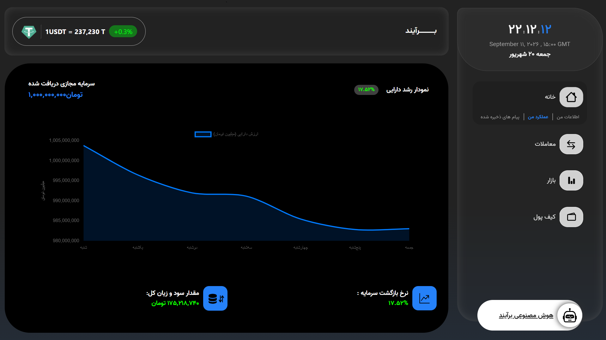
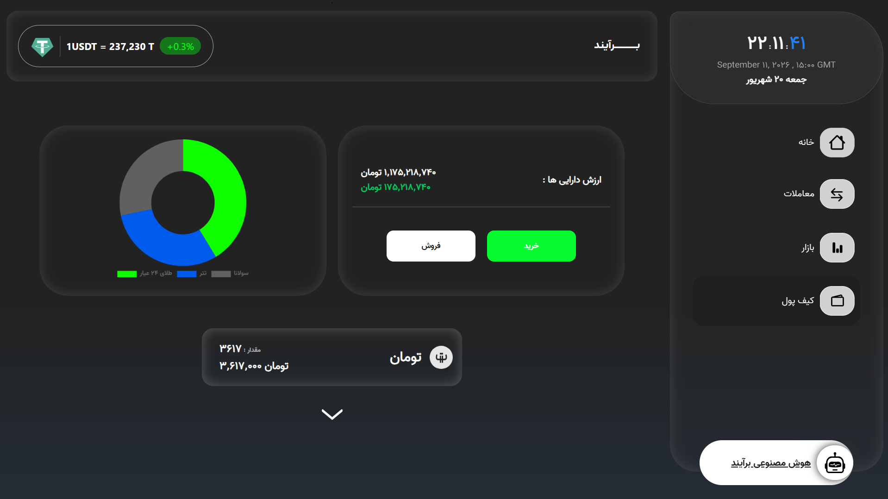
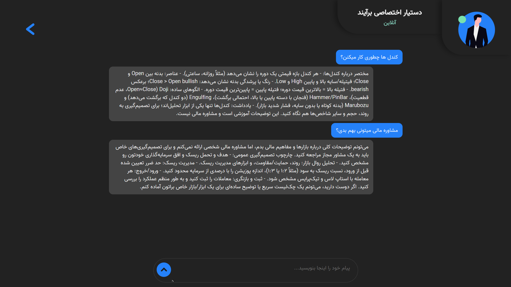

# Barayannd •• Crypto/asset trading simulation

A PHP-based simulated stock/cryptocurrency trading platform for beginners. Users start with a virtual Toman budget and trade simulated positions across crypto, gold, silver, and major currencies using live market prices (being updated every X minutes, Based on the cron execution configuration), with an integrated AI financial assistant for market guidance.

Built to be low-dependency (a single npm package, no frontend frameworks) and low-AI (the AI assistant is a bounded, optional feature with a daily message cap, not a core dependency of the platform). The frontend is handled with plain HTML, CSS, and JavaScript.







## Features

* **Phone-number-only authentication** — no passwords required for login, session-based with device/browser tracking

* **Simulated trading** — buy/sell across 18 assets (BTC, ETH, USDT, XRP, BNB, SOL, TRON, DOGE, LINK, TON, ADA, gold, silver, EUR, GBP, AED, and gold-backed tokens)

* **Portfolio tracking** — real-time valuation, daily/absolute profit-loss calculation, transaction history

* **AI chat assistant** — OpenAI-backed financial advisor with daily message limits and per-user chat history

* **Admin panel** — user management, role promotion, feature toggles (AI availability, trading, daily limits)

* **Price engine** — cron-based price fetching from external market APIs, stored historically for change calculations

* **Daily portfolio snapshots** — cron-based screenshots for tracking performance over time

* **Jalali (Persian) calendar support** — full date conversion library for localized timestamps

## Tech Stack

* PHP (PDO/MySQL)

* MariaDB/MySQL

* Chart.js (via npm) for frontend charting

* Vanilla JS for session handling

## Setup

```bash

npm i

```

1. Import the database schema from `db/barayannd.sql` into a MySQL/MariaDB instance named `barayannd`.

2. Update database credentials in `base.php` and `crons/*.php` if they differ from the defaults (`root` / no password / `127.0.0.1`).

3. Set up cron jobs for `crons/fetch_prices.php` (price updates) and `crons/take_screenshots.php` (daily portfolio snapshots).

4. Update `addresses.php` Regrading your choice of deployment method.

5. Serve the project root with a PHP-compatible web server, e.g. Apache...

## Contributors

* Mohammadreza Sadeghi — [@devmrsad](https://github.com/devmrsad)

* AliMohammad Karami — [@alimohammadkarami](https://github.com/alimohammadkarami)

## Note

This project was developed and maintained within 45 days during the international internet cutoff in Iran.
